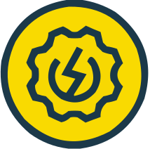
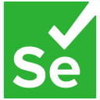
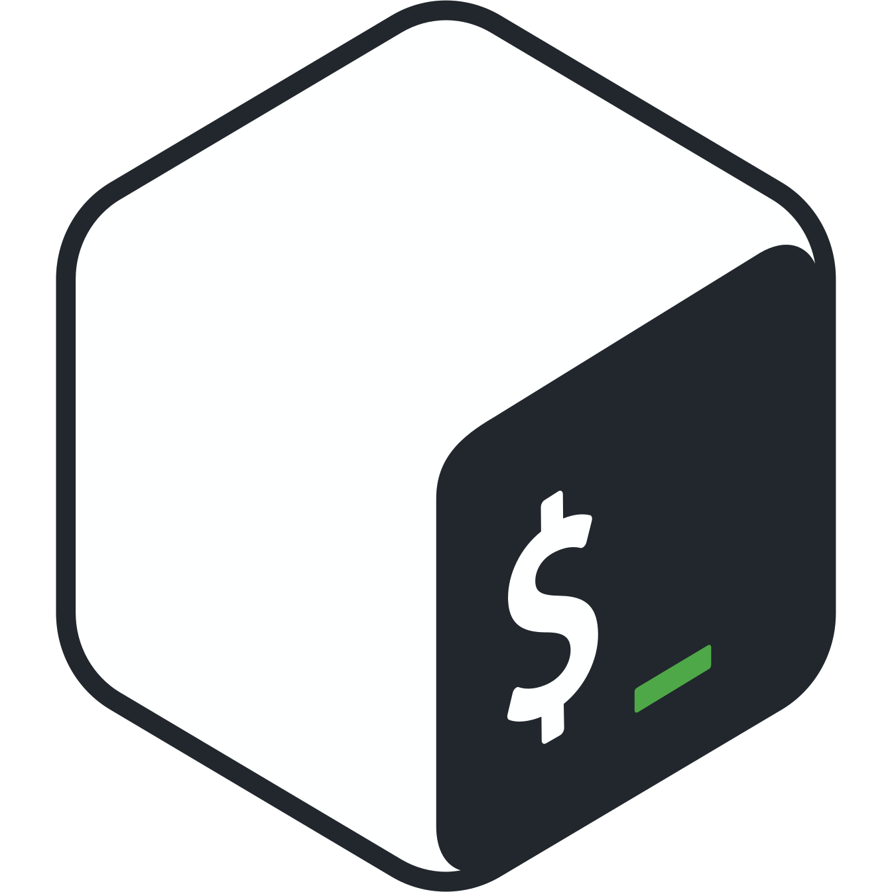

# Уголок тестировщика

Привет! Меня зовут Анна, и я тестировщик с опытом ручного тестирования веб-приложений более двух лет. Данное портфолио — результат моего обучения, практики и работы с различными инструментами и техниками дизайна тестирования. Также здесь вы найдёте моё резюме.

## :mag_right: Артефакты тестирования

:heavy_check_mark: [Чек-листы](checklists) | :memo: [Тест-кейсы](test_cases) | :lady_beetle: [Баг-репорты](bug_reports) | :man_astronaut: [Коллекции Postman](postman_collections) | :receipt: [SQL-запросы](sql_queries) | :robot: [Автотесты](https://github.com/sovietmorning/stepik_selenium_project.git)

## :hammer_and_wrench: Инструменты

#### Тестовая документация и требования

<picture></picture> <picture></picture> <picture></picture> <picture></picture> <picture></picture> <picture></picture> <picture></picture>

#### Тестирование API и анализ трафика

<picture></picture> <picture></picture> <picture></picture> <picture></picture> <picture></picture> <picture></picture> <picture></picture>

#### Работа с базами данных

<picture></picture> <picture></picture> <picture></picture>

#### Кросс-браузерное и кроссплатформенное тестирование

<picture></picture> <picture></picture> <picture></picture>

#### Автоматизация тестирования и работа с кодом

<picture></picture> <picture></picture> <picture></picture> <picture></picture> <picture></picture> <picture></picture> <picture></picture>

## :page_facing_up: Сертификация

- 2021 ISTQB Certified Tester Foundation Level
  - [сертификат](https://drive.google.com/file/d/1lklvkQnWbIJpxmTET9U9QLMWR6W_WFzd/view?usp=sharing)
  - [подтверждение на сайте ISTQB](http://scr.istqb.org/?name=Anna+Nadymova&number=84939&orderBy=relevancy&orderDirection=&dateStart=&dateEnd=&expiryStart=&expiryEnd=&certificationBody=&examProvider=&certificationLevel=&country=&resultsPerPage=10)

## :books: Сейчас изучаю

- [ООП на Python 3](https://rutube.ru/plst/537372?r=wd)
- [Docker](https://stepik.org/course/123300)
